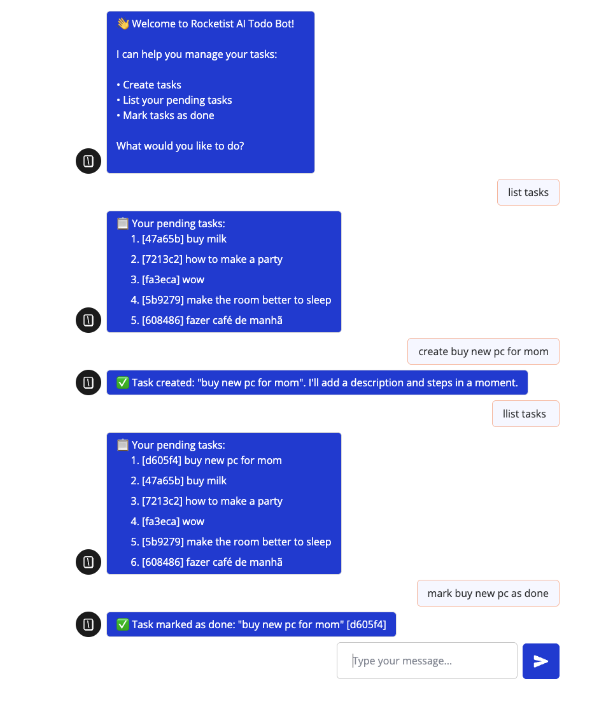
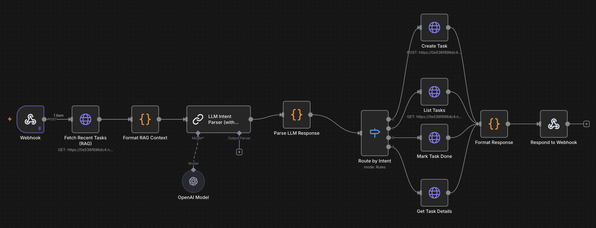
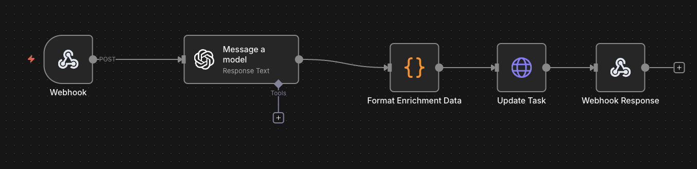

# Rocketist AI Automation

A production-ready task management system showcasing **AI automation, LLM integration, and workflow orchestration** using Next.js, n8n, and OpenAI.

## Overview

This project demonstrates advanced skills in:
- **Next.js Development**: Full-stack TypeScript application with API routes
- **n8n Workflow Automation**: Complex multi-step workflows with LLM integration
- **AI/LLM Integration**: OpenAI GPT-4o-mini with RAG (Retrieval-Augmented Generation)
- **API Integrations**: Seamless integration between Typebot, n8n, and Next.js
- **Database Architecture**: Supabase (PostgreSQL) with real-time capabilities

## Key Features

- **AI-Powered Task Enrichment**: Automatic generation of descriptions, actionable steps, and resources
- **Natural Language Interface**: Conversational task management via Typebot chatbot
- **Intent Parsing with RAG**: Context-aware LLM parsing using recent tasks
- **Workflow Automation**: n8n orchestrates complex multi-service workflows
- **Production-Ready**: Clean code, error handling, CORS support, no debug code

## Visual Documentation

### Typebot Chat Interface (Production)


Live Typebot chatbot showing natural language task management. Users can create tasks, list pending tasks, mark tasks as done, and view task details through conversational interface. This demonstrates real-world integration with n8n workflows and Next.js API.

### n8n Workflow - Typebot Intent Parser (with RAG) (Production)


Production n8n workflow handling intent parsing with LLM (OpenAI GPT-4o-mini) and Retrieval-Augmented Generation (RAG). This workflow:
- Fetches recent tasks for context
- Uses OpenAI to parse natural language intent
- Routes to appropriate API endpoints
- Handles partial task ID resolution

### n8n Workflow - Task Enrichment (Production)


Production n8n workflow for automated task enrichment. When a task is created, this workflow:
- Receives webhook from Next.js API
- Calls OpenAI LLM to generate detailed descriptions
- Creates actionable steps array
- Adds helpful links and resources
- Updates task via API

All workflows are **active in production** and demonstrate real-world automation patterns.

## Production Status

🚀 **This project is currently running in production** and demonstrates real-world implementation of:
- AI-powered automation workflows
- Multi-service integration (Typebot → n8n → Next.js → Supabase)
- Production-grade error handling and architecture
- Clean, maintainable codebase

See screenshots in [`.github/assets/`](.github/assets/) showing the live implementation.

## Requirements

### Exact Versions

- **Node.js**: 18.18.0 or higher (20.x recommended)
- **npm**: 9.x or higher
- **Next.js**: 16.0.3
- **TypeScript**: 5.x

### Required Accounts & API Keys

- **Supabase**: Account + 3 credentials (URL, anon key, service_role key)
- **OpenAI**: API key for GPT-4o-mini
- **n8n Cloud**: Free account (recommended) or Docker
- **Typebot**: Free account at typebot.io

### Optional

- **Docker & Docker Compose**: For local n8n (if not using n8n Cloud)
- **Supabase CLI**: For running migrations via CLI (or use Supabase dashboard)

## Setup Instructions

### Step 1: Verify Node.js Version

```bash
node --version
# Should be v18.18.0 or higher (v20.x recommended)

npm --version
# Should be 9.x or higher
```

If you need to install/upgrade Node.js:
- Use [nvm](https://github.com/nvm-sh/nvm): `nvm install 20 && nvm use 20`
- Or download from [nodejs.org](https://nodejs.org/)

### Step 2: Clone and Install

```bash
# Clone the repository
git clone <repository-url>
cd rocketist-fullstack

# Install dependencies
npm install
```

### Step 3: Setup Supabase

1. **Create Supabase Project**:
   - Go to [supabase.com](https://supabase.com)
   - Sign up (free tier works)
   - Click "New Project"
   - Enter project name and database password
   - Select region closest to you
   - Wait 2-3 minutes for database to be ready

2. **Get Required Credentials**:
   - Go to Project Settings → API
   - Copy these 3 values (you'll use them in Step 4):
     
     **a) Project URL:**
     - Label: `URL` or `Project URL`
     - Format: `https://xxxxx.supabase.co`
     - → Use for: `NEXT_PUBLIC_SUPABASE_URL`
     
     **b) Anon/Public Key:**
     - Label: `anon public` or `Project API keys` → `anon` `public`
     - Format: `eyJhbGc...` (long JWT string)
     - → Use for: `NEXT_PUBLIC_SUPABASE_ANON_KEY`
     
     **c) Service Role Key** ⚠️ **KEEP SECRET!**:
     - Label: `service_role` (under `Project API keys`)
     - Format: `eyJhbGc...` (long JWT string)
     - → Use for: `SUPABASE_SERVICE_ROLE_KEY`
     - ⚠️ **Never expose this in client-side code!**

3. **Run Database Migrations**:

   **Option A: Using Supabase Dashboard (Easiest)**
   - Go to SQL Editor in Supabase dashboard
   - Run migrations in order:
     1. Copy contents of `infra/supabase/migrations/20251119152124_init_tasks.sql`
     2. Paste and execute
     3. Copy contents of `infra/supabase/migrations/20251122000000_enable_realtime.sql`
     4. Paste and execute

   **Option B: Using Supabase CLI**
   ```bash
   # Install Supabase CLI (if not installed)
   npm install -g supabase
   
   # Run migrations (script automatically links to project)
   ./scripts/run-migrations.sh
   ```
   
   **Or manually:**
   ```bash
   supabase link --project-ref your-project-ref
   supabase db push
   ```

### Step 4: Configure Environment Variables

Create `.env.local` in project root:

```bash
NEXT_PUBLIC_SUPABASE_URL=https://xxxxx.supabase.co
NEXT_PUBLIC_SUPABASE_ANON_KEY=eyJhbGc...
SUPABASE_SERVICE_ROLE_KEY=eyJhbGc...  # ⚠️ Secret
N8N_BASE_URL=https://your-instance.app.n8n.cloud
```

Replace values from Steps 3 and 6. Never commit this file.

### Step 5: Start Next.js App

```bash
npm run dev
```

You should see:
```
✓ Ready in X.Xs
○ Local: http://localhost:3000
```

Open [http://localhost:3000](http://localhost:3000) - you should see the app (tasks list may be empty).

### Step 6: Setup n8n

#### Option A: n8n Cloud (Recommended for Production)

1. **Sign Up**:
   - Go to [n8n.cloud](https://n8n.cloud)
   - Sign up for free account
   - Create a new instance

2. **Set Environment Variable**:
   - Settings → Environment Variables
   - Add: `NEXT_API_URL` = `http://localhost:3000` (use production URL in production)

3. **Add OpenAI Credential** (Required):
   - Get your OpenAI API key from [platform.openai.com/api-keys](https://platform.openai.com/api-keys)
   - In n8n, go to **Credentials**
   - Click **Add Credential**
   - Search for **"OpenAI API"**
   - Enter your OpenAI API key (format: `sk-...`)
   - Name it: `OpenAI API` (or match your workflow's credential name)
   - Save

4. **Import Workflows**:
   - Go to **Workflows** → Click **"+"** → **"Import from File"**
   - Import these workflow files (in order):
     1. [`infra/docker/n8n/workflows/typebot-intent-parser.json`](infra/docker/n8n/workflows/typebot-intent-parser.json) - LLM intent parsing with RAG
     2. [`infra/docker/n8n/workflows/task-enrichment.json`](infra/docker/n8n/workflows/task-enrichment.json) - Automated task enrichment
   - Or copy-paste: Open each JSON file, copy all content, then paste into n8n UI (Workflows → "+" → Cmd/Ctrl+V)

5. **Activate Workflows**:
   - Open each workflow
   - Click the **Activate** toggle (top right)
   - Copy the webhook URL (you'll see it after activation)

6. **Update Next.js Environment**:
   - Copy your n8n instance URL (e.g., `https://your-instance.app.n8n.cloud`)
   - Update `.env.local`:
     ```bash
     N8N_BASE_URL=https://your-instance.app.n8n.cloud
     ```
   - Restart Next.js dev server (`npm run dev`)

#### Option B: Local n8n with Docker

```bash
cd infra/docker/n8n
docker-compose up -d
```

Access n8n at `http://localhost:5678`

1. Create account (first-time setup)
2. Follow same steps as Option A for credentials and workflows
3. Update `.env.local`:
   ```bash
   N8N_BASE_URL=http://localhost:5678
   ```

### Step 7: Setup Typebot

1. **Sign Up**:
   - Go to [typebot.io](https://typebot.io)
   - Sign up for free account

2. **Create New Typebot**:
   - Click "Create a typebot"
   - Name it (e.g., "Rocketist Todo Bot")

3. **Build the Flow**:

   **Block 1: Welcome Message**
   - Add **Text** block
   - Content:
     ```
     👋 Welcome to Rocketist AI Todo Bot!
     
     I can help you manage your tasks:
     • Create tasks
     • List your pending tasks
     • Mark tasks as done
     • View task details
     
     What would you like to do?
     ```

   **Block 2: Get User Input**
   - Add **Text Input** block
   - Placeholder: "Type your message..."
   - Save answer in variable: `UserMessage`

   **Block 3: HTTP Request**
   - Add **HTTP Request** block
   - Method: `POST`
   - URL: `http://localhost:3000/api/chat/typebot` (for local) or your production URL
   - Headers:
     - `Content-Type`: `application/json`
   - Body (JSON):
     ```json
     {
       "message": "{{UserMessage}}"
     }
     ```

   **Block 4: Display Response**
   - Add **Text** block
   - Content: `{{HTTP Request.body.reply}}`

4. **Connect Blocks**:
   - Connect: Welcome → Text Input → HTTP Request → Display Response
   - Loop: Connect Display Response back to Text Input (to continue conversation)

5. **Test**:
   - Click "Test" button in Typebot
   - Try: "create task buy groceries"
   - Verify response

### Step 8: Verify Everything Works

1. **Test Web UI**:
   - Go to `http://localhost:3000`
   - Create a task
   - Verify it appears in the list

2. **Test Task Enrichment**:
   - Create a task via web UI
   - Wait a few seconds
   - Check n8n execution logs (n8n → Executions)
   - Verify task gets enriched with description/steps

3. **Test Typebot**:
   - Open your Typebot
   - Test commands:
     - "create task buy milk"
     - "list tasks"
     - "done [task-id]" (use ID from list)
     - "help"

4. **Check n8n Executions**:
   - Go to n8n → Executions
   - Verify no errors
   - Check execution details if issues

### Troubleshooting

**Next.js won't start:**
- Check Node.js version: `node --version` (must be 18.18+)
- Delete `node_modules` and `.next`, then `npm install`

**Can't connect to Supabase:**
- Verify credentials in `.env.local`
- Check Supabase project is active
- Verify migrations were applied

**n8n webhook returns 404:**
- ✅ Verify workflow is **activated** (toggle in top right)
- ✅ Check `N8N_BASE_URL` matches your n8n instance URL
- ✅ Verify webhook path: `/webhook/typebot-chat` or `/webhook/task-created`

**Typebot shows error:**
- ✅ Check Next.js is running on port 3000
- ✅ Verify HTTP Request URL is correct
- ✅ Check n8n workflow is activated
- ✅ Verify OpenAI API key is set in n8n

**Task enrichment not working:**
- ✅ Check `N8N_BASE_URL` is set correctly
- ✅ Verify task enrichment workflow is activated
- ✅ Check n8n execution logs for errors
- ✅ Verify OpenAI API key is set in n8n

See [docs/SETUP.md](docs/SETUP.md) for more detailed troubleshooting.

## Architecture Highlights

- **Next.js API as single database interface** - Centralized data access layer
- **LLM processing in n8n** - Enables RAG with task context for better intent parsing
- **Partial ID resolution** - Users reference tasks by short IDs, automatically resolved to full UUIDs
- **CORS enabled** - Supports cloud-based Typebot/n8n integrations

## Project Structure

```
├── app/
│   ├── api/
│   │   ├── chat/typebot/     # Typebot integration endpoint
│   │   └── tasks/            # Task CRUD endpoints
│   └── [locale]/             # i18n frontend pages
├── components/               # React components
├── lib/
│   ├── cors.ts              # CORS utilities
│   ├── supabase.ts          # Supabase client
│   └── types.ts             # TypeScript types
├── infra/
│   ├── docker/n8n/
│   │   └── workflows/       # n8n workflow JSON files (import these)
│   │       ├── typebot-intent-parser.json
│   │       └── task-enrichment.json
│   └── supabase/            # Database migrations
└── docs/
    ├── ARCHITECTURE.md       # Detailed architecture & flow
    └── SETUP.md              # Complete setup guide
```

## n8n Workflows

Two workflows need to be imported into n8n:

1. **`typebot-intent-parser.json`** - Handles LLM-based intent parsing from Typebot messages with RAG
2. **`task-enrichment.json`** - Automatically enriches tasks with AI-generated descriptions and steps

**Location**: [`infra/docker/n8n/workflows/`](infra/docker/n8n/workflows/)

**How to import**:
- In n8n UI: Workflows → "+" → "Import from File" → Select the JSON files
- Or copy-paste: Open JSON file, copy all, paste into n8n (Workflows → "+" → Cmd/Ctrl+V)

## Scripts

```bash
npm run dev      # Start development server
npm run build    # Build for production
npm run start    # Start production server
npm run lint     # Run ESLint
```

## Documentation

- [Architecture & Flow](docs/ARCHITECTURE.md) - Visual diagrams and flow explanations
- [Setup Guide](docs/SETUP.md) - Detailed setup instructions for all components

## Deployment

### Production Checklist

- [ ] Set production environment variables in Vercel
- [ ] Update `NEXT_API_URL` in n8n to production URL
- [ ] Update Typebot HTTP Request URL to production
- [ ] Activate all n8n workflows
- [ ] Verify CORS is working
- [ ] Test end-to-end flow

### Deploy to Vercel

```bash
vercel
```

Configure environment variables in Vercel dashboard.

## Required Credentials

**Environment Variables** (`.env.local`):
- `NEXT_PUBLIC_SUPABASE_URL` - Supabase project URL
- `NEXT_PUBLIC_SUPABASE_ANON_KEY` - Supabase anon key
- `SUPABASE_SERVICE_ROLE_KEY` - Supabase service_role key ⚠️ Secret
- `N8N_BASE_URL` - n8n instance URL (e.g., `https://xxx.app.n8n.cloud`)

**n8n Configuration**:
- OpenAI API key (add as credential)
- `NEXT_API_URL` environment variable (in n8n Settings)

**Typebot Configuration**:
- HTTP Request URL: `YOUR_API_URL/api/chat/typebot`

## Implementation Details

Built with Next.js 16 (App Router), TypeScript, and React 19. The architecture leverages:

- **n8n workflows** for orchestrating LLM-based intent parsing and task enrichment
- **OpenAI GPT-4o-mini** with RAG (Retrieval-Augmented Generation) for context-aware responses
- **Supabase** for PostgreSQL database with real-time subscriptions
- **Typebot** for the conversational interface
- **RESTful APIs** with proper error handling and CORS configuration

The codebase follows production best practices: structured migrations, environment management, clean separation of concerns, and comprehensive documentation.  

## Tech Stack

- **Frontend**: Next.js 16, React 19, TypeScript, Tailwind CSS
- **Backend**: Next.js API Routes (RESTful architecture)
- **Database**: Supabase (PostgreSQL with real-time)
- **Workflows**: n8n Cloud (workflow automation)
- **Chat**: Typebot Cloud (conversational interface)
- **AI**: OpenAI (GPT-4o-mini with RAG)
- **i18n**: next-intl (multi-language support)
